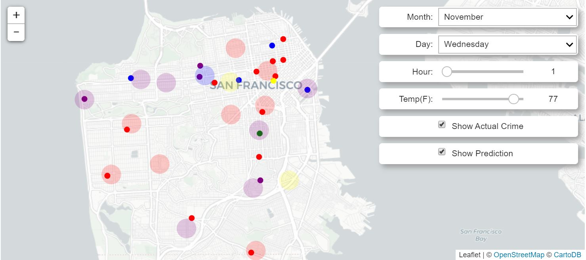

# CrimePrediction

The main goal of this project was to see how well I could predict crime type in San Francisco.
The Jupyter Lab file includes a tool I put together to visualize actual crime vs predicted crime type.
The CrimePred_report pdf file provides a detailed look at the project.

ipyleaflet is needed to run the map and widgets.

To update the prediction map after changing inputs, run all code below the first set of widgets in the file.

